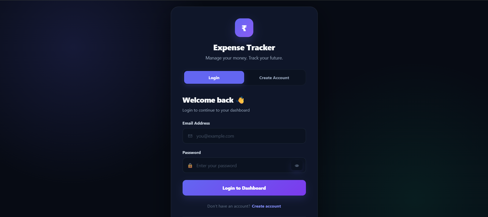
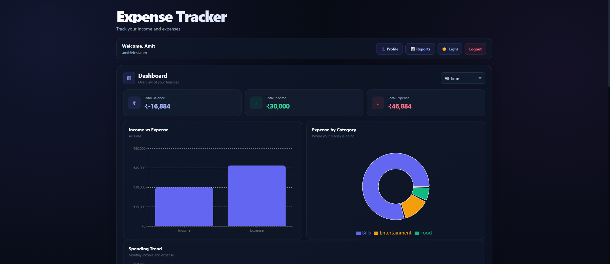
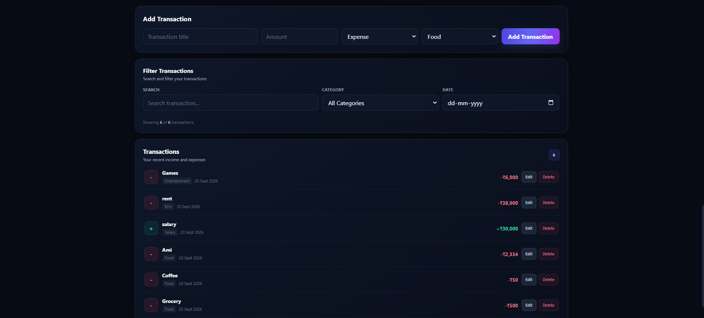
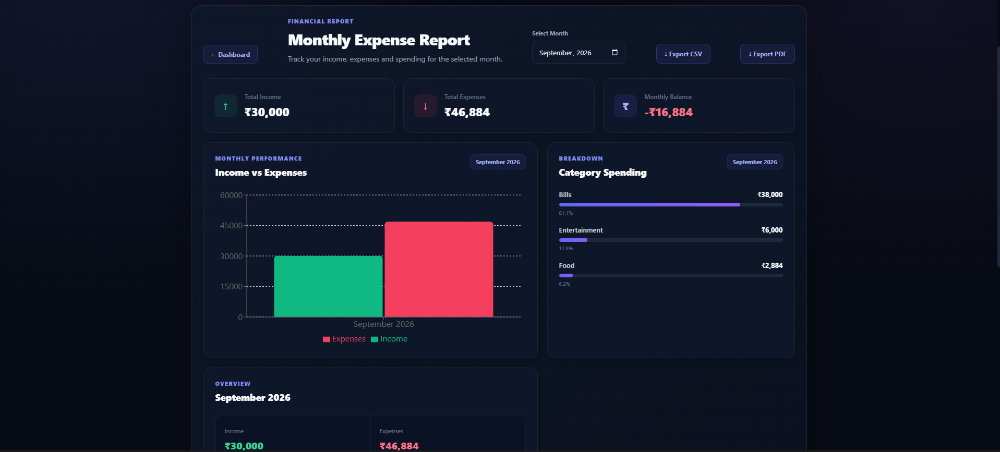
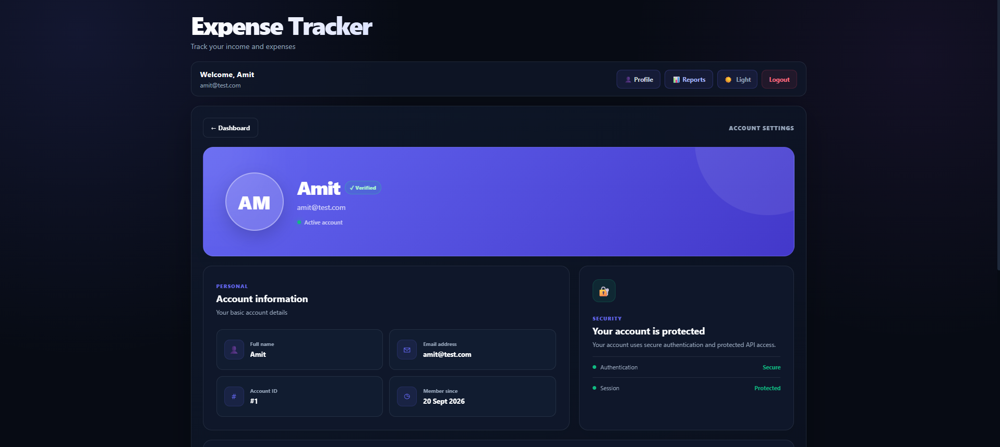

# 💰 Expense Tracker

A full-stack expense management application built with **React, Node.js, Express.js, and MySQL**.

Expense Tracker helps users securely manage their income and expenses, track their financial activity, analyze spending through interactive charts, and generate PDF reports.

---

## 🌐 Live Application

### 🚀 Frontend
https://expense-tracker-lyart-beta-32.vercel.app

### ⚙️ Backend API
https://expense-tracker-c4xe.onrender.com

---

## ✨ Features

### 🔐 Authentication

- User registration
- User login
- JWT-based authentication
- Secure password hashing with bcrypt
- Protected API routes
- Logout functionality
- Change password
- User-specific expense data

### 💸 Expense Management

- Add new expenses
- Edit existing expenses
- Delete expenses
- Track income
- Track expenses
- Expense categories
- Expense dates
- Personal expense history
- Automatic financial calculations

### 📊 Dashboard

- Total income
- Total expenses
- Current balance
- Expense summary
- Financial overview
- Spending statistics

### 📈 Reports & Analytics

- Interactive charts
- Category-wise expense analysis
- Income vs expense analysis
- Financial statistics
- Monthly/overall spending insights
- PDF report generation
- Downloadable expense reports

### 👤 Profile

- View user profile
- Account information
- Change password
- Secure authentication

### 📱 Responsive UI

- Desktop responsive design
- Mobile responsive design
- Tablet support
- Mobile-friendly dashboard
- Responsive expense management

---

# 🛠️ Tech Stack

## Frontend

- React
- Vite
- JavaScript
- CSS
- Recharts
- jsPDF
- jsPDF AutoTable

## Backend

- Node.js
- Express.js
- MySQL2
- JWT
- bcryptjs
- CORS
- dotenv

## Database

- MySQL
- Aiven Cloud

## Deployment

- Vercel — Frontend
- Render — Backend
- Aiven — Database

---

# 🏗️ Application Architecture

```text
                    ┌─────────────────────┐
                    │        USER         │
                    │   Mobile / Desktop  │
                    └──────────┬──────────┘
                               │
                               ▼
                    ┌─────────────────────┐
                    │   React + Vite      │
                    │      Vercel         │
                    │     Frontend        │
                    └──────────┬──────────┘
                               │
                         REST API + JWT
                               │
                               ▼
                    ┌─────────────────────┐
                    │   Node.js + Express │
                    │       Render        │
                    │       Backend       │
                    └──────────┬──────────┘
                               │
                               ▼
                    ┌─────────────────────┐
                    │       MySQL         │
                    │       Aiven         │
                    │      Database       │
                    └─────────────────────┘


# 📊 Application Flow

```text
              User
                │
                ▼
        ┌───────────────┐
        │ Login / Signup│
        └───────┬───────┘
                │
                ▼
          JWT Authentication
                │
                ▼
        ┌───────────────┐
        │   Dashboard   │
        └───────┬───────┘
                │
       ┌────────┼────────┐
       │        │        │
       ▼        ▼        ▼
    Expenses  Reports  Profile
       │        │        │
       └────────┼────────┘
                │
                ▼
         Express REST API
                │
                ▼
             MySQL


📱 Responsive Experience

The application is designed to work across:

💻 Desktop
💻 Laptop
📱 Mobile
📲 Tablet

The production application has been tested on both desktop and mobile environments.

🧪 Testing

The application has been tested for:

User signup
User login
JWT authentication
Adding expenses
Editing expenses
Deleting expenses
User-specific expense access
Dashboard calculations
Reports
PDF generation
Production API connectivity
Desktop usage
Mobile usage
🚀 Project Highlights

This project demonstrates practical experience with:

React
   ↓
REST APIs
   ↓
Node.js
   ↓
Express.js
   ↓
JWT Authentication
   ↓
MySQL
   ↓
Cloud Database
   ↓
Cloud Deployment

It combines frontend development, backend development, database management, authentication, API development, and cloud deployment into one complete full-stack application.

🔮 Future Improvements

Possible future features include:

Advanced expense filtering
Budget management
Monthly budgets
Recurring expenses
Financial goals
CSV export
Email notifications
Advanced analytics
Detailed financial insights
Multi-currency support
👨‍💻 Developer
Amit Kumar

Full-Stack Web Developer

Skills Demonstrated
HTML
CSS
JavaScript
React
Node.js
Express.js
MySQL
REST API
JWT Authentication
Git & GitHub
Vercel
Render
Aiven Cloud
⭐ Support

If you like this project, consider giving the repository a ⭐ on GitHub.

📄 License

This project is created for learning, portfolio, and demonstration purposes.
## 📸 Screenshots

### 🔐 Login


### 📊 Dashboard


### 💰 Transactions


### 📈 Reports


### 👤 Profile



